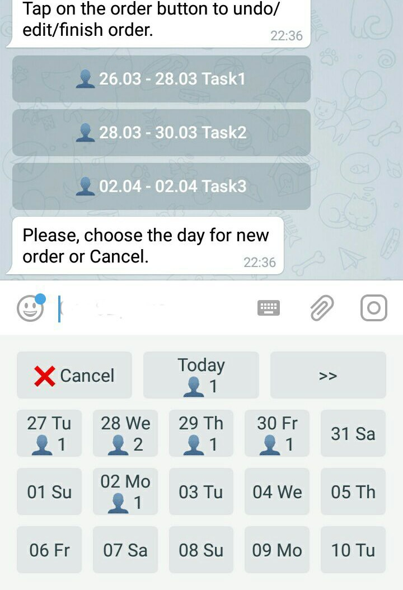

# Your orders, clients, employees, schedule and a catalog of goods inside Telegram messenger

BusinessSectorBot keeps a schedule for people and organizations that serve customers by appointment.

If you work alone, the bot will offer you:

- call phone numbers on mobile devices with one click directly from the schedule, if the phone number is recorded in an international format
- maintaining a list of customers with a convenient search and the history of their orders
- backup all the data entered by you (client list, current schedule, and list of completed orders) as CSV files for analysis or for safety

If your activity is related to the distribution of goods and services from the catalog, then you can provide your customers the opportunity to make their own requests through Telegram, choosing the goods they need from your catalog.

In this case, you will receive applications from customers with an exact description of the goods they need with the codes (if you specified them in the catalog) and prices. You will need to set the final cost of the order and the date of its execution.

The customer will automatically receive notifications to Telegram about all changes to his order: acceptance, rejection, completion, change of value and execution date. Alerts contain a link to contact you for feedback.

You can also do mass messaging about discounts, special offers, etc to all your customers, that used Telegram to make orders.

If your company employs several people, the bot will additionally provide:

- differentiation of employees' access to data, according to the authorities you set
- logging real-time actions of all employees of your company
- notification of authorized employees about changes in the schedule, connections of new customers and new requests submitted via Telegram

If you encounter any problem when using a bot, you can always get help from the developers in the [support group](https://t.me/joinchat/CJ4MSENU_YzXeKIpVfdTHw).
The [special Telegram channel](https://t.me/bsbnewsen) publishes news about all the changes in the bot.

Try [BusinessSectorBot](https://telegram.me/BusinessSectorBot?start=144575560_github-en)
