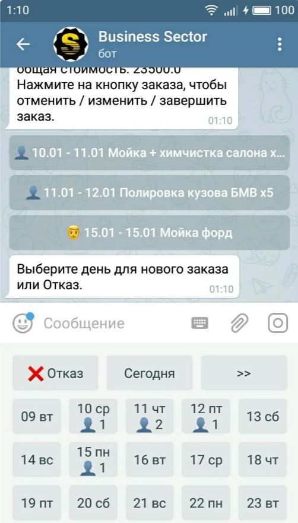

# Расписание ваших задач в Telegram

BusinessSectorBot ведет расписание для людей и организаций, которые работают с клиентами по предварительной записи.

Если вы работаете в одиночку, бот также предложит вам:

- вызов телефонных номеров на мобильных устройствах одним кликом прямо из расписания, если телефонный номер записан в международном формате (начинаясь с +7)
- ведение списка клиентов с удобным поиском и истории их заказов
- сохранение всех введенных вами данных (список клиентов, текущее расписание и список завершенных заказов) в виде csv файлов для анализа или резервного копирования
- учет движения наличных денег

Если ваша деятельность связана с распространением товаров и услуг из каталога, то вы можете предоставить своим клиентам возможность самостоятельно делать заявки через Telegram, выбирая нужные им товары из вашего каталога.

В этом случае вы будете получать от клиентов заявки с точным описанием нужных им товаров с **артикулами** (если вы их задали в каталоге) и ценами. Вам останется назначить окончательную стоимость заказа и дату его выполнения.

Клиент будет автоматически получать в Telegram оповещения о всех изменениях своего заказа: принятие, отклонение, завершение, изменение стоимости и даты исполнения. Оповещения содержат ссылку для контакта с вами для обратной связи.

Вы также можете делать массовые **рассылки** о скидках, спецпредложениях и т.п. для всех ваших клиентов, использующих Telegram для создания заявок.

Если в вашей компании работает несколько человек, бот дополнительно обеспечит:

- разграничение доступа сотрудников к данным, согласно заданным вами полномочиям
- протоколирование в реальном времени действий всех сотрудников вашей компании
- оповещение уполномоченных сотрудников об изменениях в расписании, подключении клиентами своих аккаунтов Telegram и новых заявках, поданных через Telegram

Если вы столкнетесь с какой-то проблемой при использовании бота, то всегда сможете получить помощь от разработчиков в [группе поддержки](http://ttttt.me/joinchat/CJ4MSENU_YzXeKIpVfdTHw) пользователей бота.
В [специальном канале](http://ttttt.me/bsbnewsru) Telegram публикуются новости о всех изменениях в боте.
Также есть [канал Youtube](https://www.youtube.com/channel/UCgMiAChAiSJFH_YFGHG2Y7g) на котором публикуются короткие обучающие ролики про использование бота.

Попробовать [BusinessSectorBot](https://telegram.me/BusinessSectorBot?start=144575560_github-ru)
