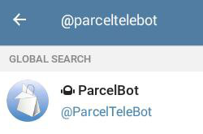
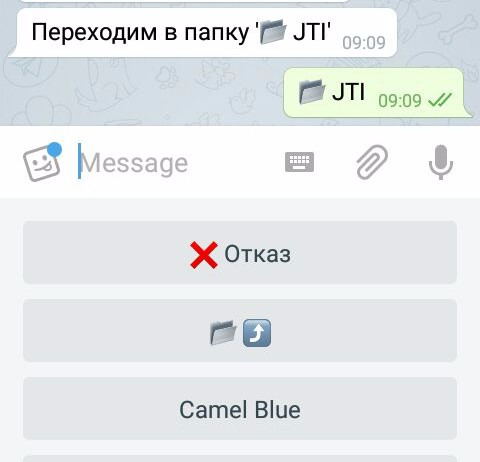
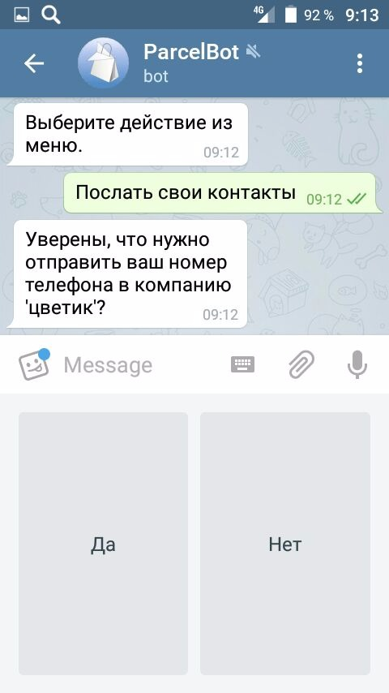
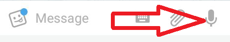

# Микрологистика. Заявки с торговых точек

### У меня несколько торговых точек. Каждый день продавцы звонят, что им нужно привезти. Связь плохая, слышно плохо, названия товаров путают. Часто звонят не вовремя. Можно как-то эти проблемы решить?

Можно. Нужно нанять человека, который будет принимать эти звонки, перезванивать и уточнять, если нужно, сводить все заявки вместе и докладывать. А можно не человека, а робота. Он будет работать круглосуточно без выходных и больничных. И зарплату ему платить не надо.

### Робот??? :/

Эээ.. :) Ну, компьютерная программа. Или кратко - бот.

### И как мои продавцы с этим ботом общаться будут? По телефону? Компьютеров то у них нет.

Через смартфон или планшет. Есть такой чат, называется Telegram. Ну типа Viber, Skype, ICQ или WhatsApp. Он бесплатный, пусть поставят себе на телефон. В этом чате и будут с ботом общаться.

### Как найти вашего бота в Telegram и как с ним общаться?

Найти бота можно по имени. В поле поиска Telegram (где значок лупы) набрать @parceltelebot.

Но пока пользы от него мало. Бот не знает, какие товары можно включать в заявку и что делать с вашими заявками. Сначала нужно создать компанию, откуда бот будет брать список товаров и куда он будет отсылать заявки.

Это можно сделать на сайте parcel-bot.store в личном кабинете. Войти в личный кабинет можно, используя ваш аккаунт Telegram.

### Как сделать первоначальную настройку и задать список моих товаров?

После того, как авторизуетесь на сайте, нужно в несколько простых шагов настроить вашу компанию: название, список товаров, первую торговую точку. На все обычно уходит не более минуты.

Подробнее стоит сказать о настройке справочника товаров.

Набор товаров индивидуален для каждой компании. Когда вы делаете первоначальную настройку своей компании, то вам предлагается на выбор несколько готовых наборов товаров из разных областей деятельности. Вы можете выбрать наиболее подходящий для вас, а затем доработать под свои нужды. Если ничего подходящего нет, то можно создать пустой набор и затем подготовить свой набор товаров с нуля.

Вы можете подготовить набор товаров в виде [файла специального формата](goods.md) и загрузить его на сайт. Или при помощи редактора справочника товаров сайта внести сначала несколько наиболее ходовых товаров, а затем пополнять этот список при необходимости.

Для каждой позиции в справочнике можно загрузить изображение, которое будет показываться в Telegram при запросе количества этой позиции в заявке. Изображение, загруженное для папки будет показано в Telegram при входе в эту папку справочника.

Впрочем, можно оставить справочник товаров пустым и посылать заявки просто с произвольным текстом и фотографиями (см. далее про примечание и фото)

### Как сделать первую заявку?

Перейдите в Telegram и в экранном меню чата с ботом выберите `Новая заявка`.

В созданную заявку можно добавлять позиции при помощи пункта меню Выбрать товар. Бот будет показывать вам в виде меню содержимое справочника товаров вашей компании. Выбирая из меню папки, вы можете перемещаться по структуре вашего справочника. Выбрав товар, введите его количество в заявке.

Для редактирования позиций заявки используйте пункт Редактирование. Бот покажет текущие позиции заявки в виде меню. Выберите нужный пункт и укажите новое количество товара в заявке.

Для удаления товара из заявки введите 0 (ноль) при запросе количества.

### У меня большой список товаров. Можно сразу найти товар по названию, не лазая по папкам?

Можно. Выберите пункт Найти товар и отправьте боту строчку с фрагментом наименования нужного товара. Он найдет в общем списке товаров все позиции, в названии которых присутствует отправленная строка, сформирует из них список и предложит выбрать нужный товар из этого списка.

### Можно к заявке прицепить дополнительную информацию?

Пункты меню Примечание и Фото. Можно ввести текст, который будет сохранен как примечание к заявке и прикрепить к заявке до 10 изображений. Для прикрепления изображений нажмите на кнопку с изображением скрепки, выберите фото со своего телефона, или кнопку с изображением камеры и сделайте фотографию.

### Хорошо, сделал заявку. Как теперь ее отправить и где потом искать?

Пункт меню Отправить заявку. После этого ее можно увидеть на сайте parcel-bot.store в разделе "Заявки". Кликните по нужной заявке в списке, чтобы просмотреть ее содержимое. Там же можно скачать заявку себе на компьютер в виде csv-файла для обработки в Excel.

### А как добавить еще одну торговую точку?

На сайте перейдите в раздел "Точки" и кликните по кнопке "Добавить новую точку".

### На этой точке другой продавец. Как он сможет делать заявки?

Этот продавец должен зарегистрировать собственный аккаунт в Telegram. После этого отправьте ему приглашение. Приглашение - это ссылка, по которой он должен перейти и принять приглашение. После этого его аккаунт появится в списке сотрудников вашей компании и он сможет отправлять вам заявки.

Ссылку для отправки новому продавцу вы можете создать на сайте в разделе "Приглашения".

Для каждого приглашения сайт автоматически создает специальную картинку (QR-код), в которой закодирована нужная ссылка. Есть много бесплатных программ, которые читают QR-коды при помощи камеры мобильного телефона и предлагают перейти по ссылке из QR-кода. Можно напечатать QR-код приглашения на карточках, визитках и т.п. и распространять приглашения и таким путем.

### Может один продавец обслуживать несколько точек?

Да, до 100 точек. На сайте перейдите в раздел "Сотрудники" и кликните в списке по нужному сотруднику. В нижней таблице нужно галками в левой колонке отметить те точки, откуда сотрудник может посылать заявки, и нажать кнопку "Добавить выбранные точки к сотруднику".

После этого при создании новой заявки бот будет предлагать этому сотруднику выбрать из списка точку, для которой он создает заявку. Если он передумал, то он может удалить текущую заявку, выбрав пункт меню Удалить заявку и затем создать новую заявку, выбрав другую точку.

### А на одной точке может быть много продавцов?

Да. На сайте перейдите в раздел "Точки" и кликните в списке точек на цифре в колонке "Сотрудники" у точки, куда вы хотите добавить несколько сотрудников.

В нижней таблице галками в левой колонке отметить нужных сотрудников и нажать кнопку "Добавить выбранных сотрудников на эту точку".

### Мне нужно видеть телефон человека, отправившего заявку, чтобы перезвонить ему при необходимости

Для этого продавец должен отправить боту в Telegram свой номер телефона. В корневом меню выбрать Настройки, а затем Послать свои контакты. После этого в списке заявок рядом с именем продавца, отправившего заявку, будет отображаться его номер телефона.

### Мне нужно свести вместе несколько заявок

В разделе сайта "Заявки" нужно отметить галками в левой колонке выбранные заявки, в выпадающем списке над таблицей выбрать пункт "Создать сводную ведомость" и нажать кнопку "Выполнить".

Созданная суммарная ведомость в дальнейшем будет доступна в разделе "Документы". Там ее можно просмотреть и скачать на компьютер в виде csv-файла для редактирования в Excel.

### Я хочу узнавать о новых заявках сразу же после их отправки. Для этого мне нужно все время проверять список заявок на вашем сайте?

Нет, сидеть все время на сайте не нужно. В Telegram зайдите в раздел Настройки в меню бота и выберите пункт Оповещение. Включите режим оповещений и бот будет оповещать вас о поступлении новых заявок с тех точек, на которые назначен ваш аккаунт.

### Я уволил продавца. Как запретить ему посылать мне заявки?

Удалите его из списка сотрудников своей компании. Нужно зайти в раздел "Сотрудники", отметить галкой в левой колонке уволенного сотрудника, выбрать в выпадающем списке пункт "Удалить" и нажать кнопку "Выполнить".

### У меня появилось несколько новых товаров и несколькими товарами я прекратил торговать. Как мне добавить новые товары и запретить заказывать убранные из продажи товары?

На сайте зайти в раздел "Товары" и добавить новые товары, нажимая кнопку "Новая позиция". Товары будут добавляться в текущую папку справочника.

Чтобы запретить включать в заявки какие-то товары, нужно отметить их галочкой в левой колонке в списке товаров, в выпадающем списке над таблицей товаров выбрать пункт "Установить выбранные как неактивные" и нажать кнопку "Выполнить".

### Мне нужен помощник, который будет следить за справочником товаров, управлять приглашениями, сотрудниками и т.п. Но я не хочу давать ему свой аккаунт Telegram для входа на сайт.

Можно назначить одного или нескольких сотрудников компании "управляющими". Это можно сделать на сайте в разделе Сотрудники. "Управляющий" может заходить на сайт через свой аккаунт Telegram и делать все, что и вы, кроме двух вещей:

- назначать / удалять "управляющих"
- полностью удалить компанию

### С одной точки каждый раз заказывают примерно постоянный набор товаров. Можно для них как-то ускорить оформление заявок, чтобы не нужно было каждый раз выбирать одни и те же товары?

Сделайте для такой точки шаблон заявки. Это список товаров, количество которых бот будет запрашивать при создании каждой новой заявки для этой точки.

Перейдите на сайте в раздел "Точки" и кликните по цифре (если шаблон не задан, то это цифра ноль) в колонке "Товары" у нужной точки. В списке товаров отметьте позиции для включения в шаблон и нажмите кнопку "Добавить выбранные элементы в набор".

### Как напомнить продавцам о новых товарах, которые у меня только что появились?

Включите их в шаблоны заявок. Бот будет спрашивать о новинках при создании каждой заявки.

Только тут важно не переборщить. Вряд ли продавцы будут рады отвечать на сто вопросов при создании каждой заявки, если большинство этих товаров им не нужно.

### У меня продавцы на морозе стоят и жалуются, что кнопки нажимать в перчатках неудобно. Вот если бы боту можно было продиктовать заявку...

Просто продиктовать всю заявку не получится, наука до этого пока не дошла. Но кое-что продиктовать можно. Если в Telegram нажать и удерживать кнопку с микрофоном, продиктовать текст и отпустить кнопку, то бот попытается понять, что было сказано. Так можно делать везде, где нужно набирать текст: при поиске товара по названию, при вводе его количества и вводе текста примечания к заявке.
Только [дикция нужна хорошая](https://youtu.be/1ugivNRYfjc?t=3m34s) :)

Голосовой ввод не работает, если нужно выбирать из меню, которое предлагает бот. Но в меню кнопки большие, промахнуться трудно.

За возможность голосового ввода спасибо Яндексу (Использует сервис [Yandex SpeechKit Cloud](https://tech.yandex.ru/speechkit/cloud/)).

### В начале что-то было про "зарплату боту платить не надо". Это все бесплатно? Так не бывает.

Иногда бывает. Если у вас небольшой список товаров и за сутки подается немного заявок, то можно пользоваться бесплатно.
